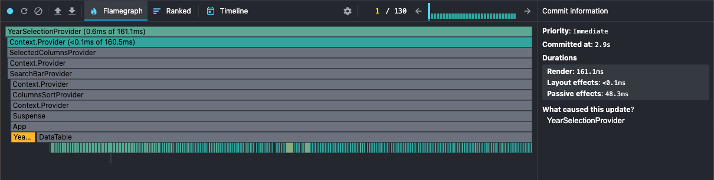
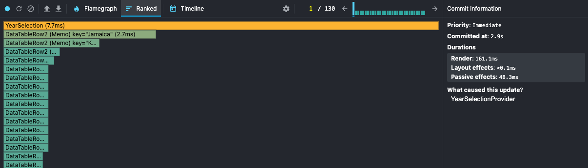
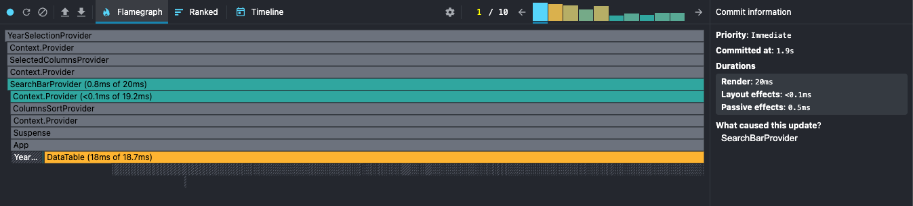
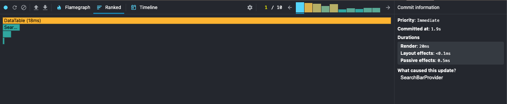
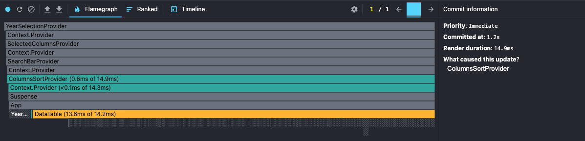
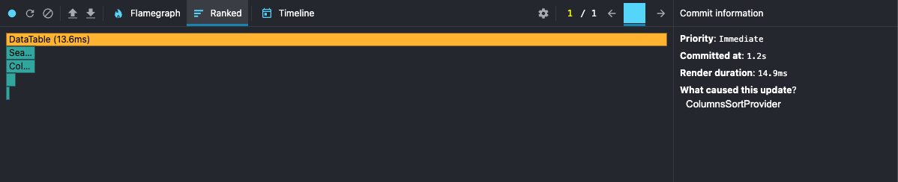
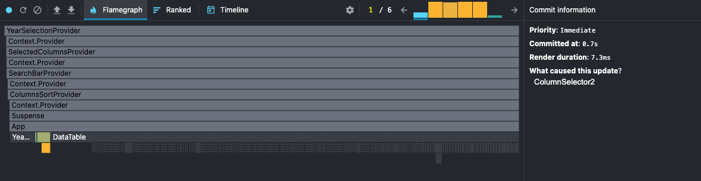
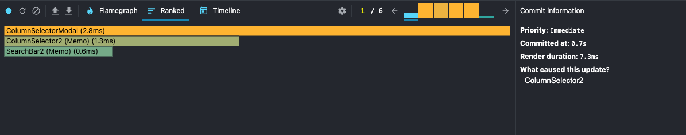

# RSS React App: Performance

## Getting Started

Ensure you have the following installed on your machine:

- [**Node.js**](https://nodejs.org/) (v20 and later)
- [**npm**](https://www.npmjs.com/)

## Installation

Clone the repository and install the dependencies:

`git clone git@github.com:irinaboiko/RSS-REACT2025Q3.git`

`git checkout performance`

`npm install`

## Running the App in Development

To start the development server:

`npm run dev`

## Code Quality

### Linting

Run ESLint to check for code issues:

`npm run lint`

### Formatting

Run Prettier to auto-format your code:

`npm run format:fix`

# Performance Profiling

Profiling done with **React DevTools Profiler** (Commit/Render Duration, Flamegraph, Ranked).

## Testing Scenarios:

- Selecting a year (2023 -> 2018)
- Searching a country ("" -> "Austria")
- Sorting the Name column (`"asc"` -> `"desc"`)
- Adding additional columns (`Methane`, `Oil CO₂`, `Gas CO₂`, `Temperature change from CO₂`)

## 1. Testing Scenario: Selecting a year (2023 -> 2018)

|                 | Before optimization | After optimization |
| --------------- | ------------------- | ------------------ |
| Commit Duration | 3s                  | 2.9s               |
| Render Duration | 152.8ms             | 161.1ms            |

**Interactions**: Not recorded.

#### Flame Graph - Before optimization:

#### Flame Graph - After optimization:

#### Ranked Chart - Before optimization:

#### Ranked Chart - After optimization:

## 2. Testing Scenario: Searching a country ("" -> "Austria")

|                 | Before optimization | After optimization |
| --------------- | ------------------- | ------------------ |
| Commit Duration | 2.2s                | 1.9ms              |
| Render Duration | 162.2ms             | 20ms               |

**Interactions**: Not recorded.

#### Flame Graph - Before optimization:

#### Flame Graph - After optimization:

#### Ranked Chart - Before optimization:

#### Ranked Chart - After optimization:

## 3. Testing Scenario: Sorting the `Name` column (`"asc"` -> `"desc"`)

|                 | Before optimization | After optimization |
| --------------- | ------------------- | ------------------ |
| Commit Duration | 1.5s                | 1.2s               |
| Render Duration | 183.3ms             | 14.9ms             |

**Interactions**: Not recorded.

#### Flame Graph - Before optimization:

#### Flame Graph - After optimization:

#### Ranked Chart - Before optimization:

#### Ranked Chart - After optimization:

## 4. Testing Scenario: Adding additional columns (`Methane`, `Oil CO₂`, `Gas CO₂`, `Temperature change from CO₂`)

|                 | Before optimization | After optimization |
| --------------- | ------------------- | ------------------ |
| Commit Duration | 1.2s                | 0.7s               |
| Render Duration | 6.3ms               | 7.3ms              |

**Interactions**: Not recorded.

#### Flame Graph - Before optimization:

#### Flame Graph - After optimization:

#### Ranked Chart - Before optimization:

#### Ranked Chart - After optimization:

